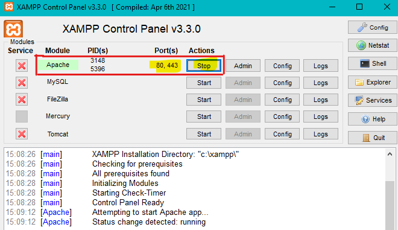
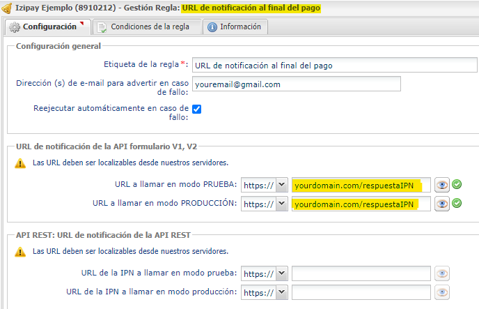

# Redirect-Payment-Form-PHP-MVC

Ejemplo del formulario de pago en redirección con el uso del patrón Modelo Vista Controlador desarrollado con PHP y Javascript


<a name="Requisitos_Previos"></a>

## Requisitos Previos

* Extraer claves de autentificación. [Guía Aquí](https://github.com/izipay-pe/obtener-credenciales-de-conexion)
* Instalar XAMPP [Aquí](https://www.apachefriends.org/es/index.html)

## 1.- Crear el proyecto 
Descargar el proyecto .zip ingresado [aquí](https://github.com/izipay-pe/Redirect-Payment-Form-PHP-MVC/archive/refs/heads/main.zip) ó clonarlo con git

```sh
git clone https://github.com/izipay-pe/Redirect-Payment-Form-PHP-MVC.git
``` 

* Paso 1.- Mover el proyecto y descomprimirlo en la carpeta htdocs en la ruta de instalación de Xampp: `C:\xampp\htdocs`

  

* Paso 2.- Abrir la aplicación XAMPP Control Panel ejecutar el botón **Start** del modulo de **Apache**, quedando de la siguiente manera:

  

* Paso 3.- Abrir el navegador web(Chrome, Mozilla, Safari, etc) con el puerto 80 que abrió xampp : **http://localhost:80/Redirect-Payment-Form-PHP/** y realizar una compra de prueba.

  

* Error: **PaymentFormError = 02 vads_side_id**, este error saldrá porque no se tiene configurado las credenciales de integración en el archivo **./example.configKey.php** .  
 Estas mismas credenciales se encuentran en su [Back Office Vendedor de Izipay](https://secure.micuentaweb.pe/vads-merchant/) en la siguiente ruta: **Configuracion - Tienda - Claves**  
 Más información [ver requisitos previos](#requisitos-previos).
 
  

## 2.- Configurar el identificador de su tienda y la clave:
Obtener las credenciales de su Back Office Vendedor y copiarlas en las variales correspondientes en el archivo: `models/example.configKey.php ` 

```sh
// Identificador de su tienda
PaymentModel::setDefaultShopId("12345678");

// Clave de TEST y Producción de su Back Office Vendedor.
PaymentModel::setDefaultTestKey("2222222222222222");
PaymentModel::setDefaultProdKey("3333333333333333");

// URL de la plataforma de pago
PaymentModel::setDefaultUrlPayment("https://secure.micuentaweb.pe/vads-payment/");

// Modo de Configuración
PaymentModel::setDefaultMode("TEST");

``` 
## 3.- Configurar la respuesta del pago por IPN (Instant Payment Notification)
Configurar la URL de notificación al final del pago para que su servidor web esté al tanto de la información del estado de pago de la transacción. Vea la documentación para más información. Aquí [IPN](https://secure.micuentaweb.pe/doc/es-PE/form-payment/quick-start-guide/implementar-la-ipn.html)

* Ver manual de implementacion de la IPN [Aquí](https://secure.micuentaweb.pe/doc/es-PE/rest/V4.0/kb/payment_done.html)

* Ver el ejemplo de la respuesta IPN con PHP [Aquí](https://github.com/izipay-pe/Redirect-PaymentForm-IpnT1-PHP)

* Ver el ejemplo de la respuesta IPN con NODE.JS [Aquí](https://github.com/izipay-pe/Response-PaymentFormT1-Ipn)

    

## 4.- Tranascción de prueba
El formulario de pago está listo, puede intentar realizar una transacción utilizando una tarjeta de prueba con la barra de herramientas de depuración (en la parte inferior de la página).

  

## 5.- Soporteecommerce@izipay.pe
Para más información comunicarse al correo del equipo de soporte de Izipay.  
**Asunto**: Mensaje + RUC + codigo de comercio / Razon Social.